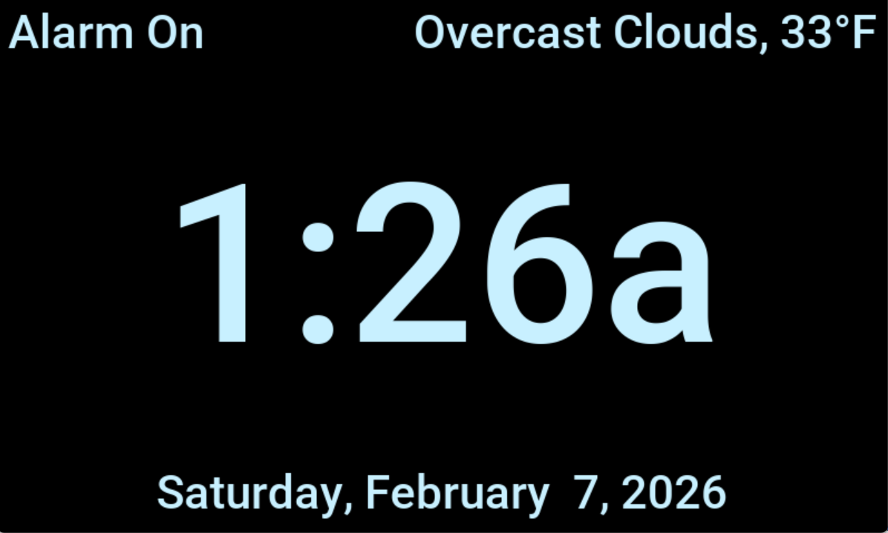
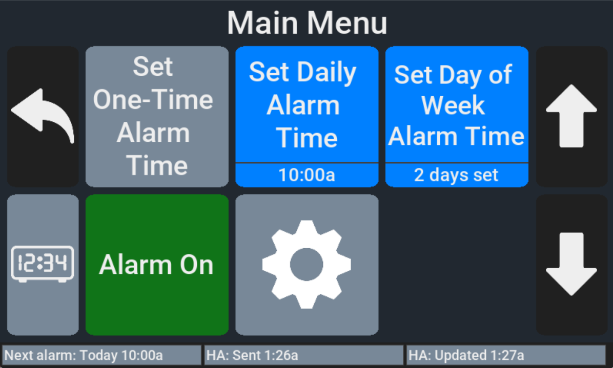
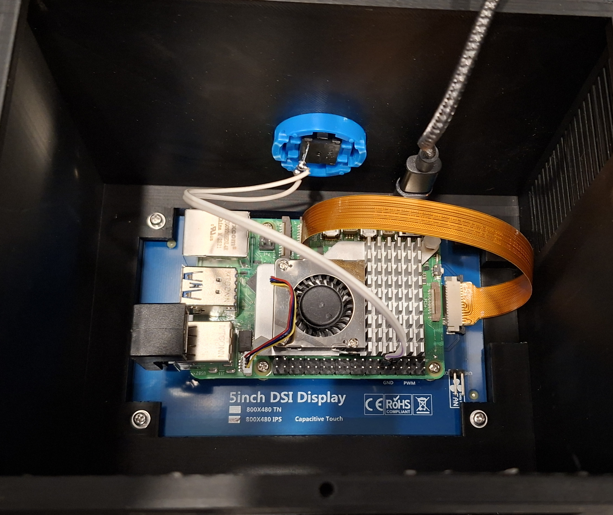

# Touchscreen Alarm Clock

A 3D printed touchscreen alarm clock with Home Assistant integration, designed for Raspberry Pi with a 5" display.

Pull Requests are welcome if you'd like to contribute.

## 3D Models


[View Alarm Clock Main Body](STL%20Models/Alarm%20Clock%20-%20Main%20Body.stl)
[View Alarm Clock Rear Panel](STL%20Models/Alarm%20Clock%20-%20Rear%20Panel.stl)

## Screenshots




## Features

- Large, easy-to-read time display
- Multiple alarm modes: one-time, daily, and per-day-of-week scheduling
- Automatic alarm re-enable at midnight option. For example if you have a one-time alarm set for 8:30am and your regular alarm at 9:00am it won't go off twice
- Automatic screen dimming at night. (Based on time of day or sun position)
- Optional Home Assistant integration for:
  - Weather & temperature display
  - Alarm state push synchronization to Home Assistant.
- Configurable screen timeout
- Touch-friendly menu interface

## Bill of Materials

| Component | Description | Link |
|-----------|-------------|------|
| Raspberry Pi 5 or 4B. A 3A/3A+/3B+ will probably also work, see notes below. | Main computer | [Buy on Amazon](https://www.amazon.com/dp/B0CK3L9WD3/) |
| Raspberry Pi 5 Cooler (probably optional, but it's only $10) | Cooler | [Buy on Amazon](https://www.amazon.com/dp/B0CLXZBR5P/) |
| MicroSD Card. I used a SanDisk High Endurance for reliability | Storage for OS and application | [Buy on Amazon](https://www.amazon.com/dp/B07P14QHB7/) |
| Hosyond 5" DSI Display | 800x480 capacitive touchscreen | [Buy on Amazon](https://www.amazon.com/dp/B0CXTFN8K9/) |
| USB Sound Card with Speakers | So you can hear the alarm going off | [Buy on Amazon](https://www.amazon.com/dp/B0CN1C1VPR/) |
| 4 count - M2.5x8 screws with washers | For mounting LCD panel | [Buy on Amazon](https://www.amazon.com/dp/B0FG2DQYY7/) |
| 4 to 8 count (use your judgement) - M2.5x8 or M3x8 screws with washers | For mounting rear panel | Included in kit above |
| 4 to 8 count (use your judgement) - M3x8 screws with washers | For mounting speakers | Included in kit above |
| Pi Power Supply | 5V 5A power supply for Pi 5 | [Buy on Amazon](https://www.amazon.com/dp/B07H125ZRL/) |
| 90 degree USB-C adapter | For Pi 5 power supply | [Buy on Amazon](https://www.amazon.com/dp/B0B2NJ3P3L/) |
| U-Shape/180 degree USB-A adapter. If you buy a different one watch the polarity of the end that connects to the Pi, it won't work if it's opposite from these. See [USB-C 180 Adapters.png](./Images/USB-C_180_Adapters.png) for an example. | For USB Sound Card | [Buy on Amazon](https://www.amazon.com/dp/B0BZ4M7FYH/) |
| Option 1: Adafruit 4259 USB-C to USB-A Jack and a 6" USB-A to USB-C Cable | Power inlet on the back of the case | [Buy on Amazon](https://www.amazon.com/dp/B082FNRPWL/) |
| Option 2: Adafruit 4261 USB-C to USB-C Jack and a 6" USB-C to USB-C Cable | Power inlet on the back of the case | [Buy on Adafruit](https://www.adafruit.com/product/4261) |
| uxcell 30mm Arcade Button | For turning off the alarm when it's going off | [Buy on Amazon](https://www.amazon.com/dp/B07XYW58HV/) [They have other colors too](https://www.amazon.com/s?k=uxcell+30mm+Mounting+Hole+Game+Push+Button) |
| 2x ~20cm Jumper Wires with Dupont connectors on at least one end | For connecting the Arcade Button to the Pi | [Buy on Amazon](https://www.amazon.com/dp/B0BRTJQGS6) |
| 4x Small Rubber Feet (Cabinet Door/Drawer Bumpers) | For the bottom, for grip and to allow airflow in for cooling | [Buy on Amazon](https://www.amazon.com/dp/B08BR6CGWL) |
* For the power supplies / USB-C adapters, these will be different if you are using Pi 3's since they aren't USB-C.
* Where I'm using this I happen to have a UPS already to plug into for power reliability. I haven't checked it closely but [this UPS hat](https://www.amazon.com/GeeekPi-Raspberry-Uninterruptible-Management-Expansion/dp/B09NKFYHVK) might work, but you'd have to flip the standoffs over in the opposite direction from the pictures.

## How to Build

1. 3D Print both the main body and rear panel. I used PLA+ and 0.20mm Strength profile + Gyroid + PETG Support Interface (3MF included with this preset.) The PETG support inteface is optional, but will make your life easier. Printing upside down for the main body seemed to be the best compromise of time and support material used. You can do everything through step 7 while it's printing.
2. Use [Raspberry Pi Imager](https://www.raspberrypi.com/software/) to install Raspberry Pi OS onto your SD card. Pre-set the WiFi info and enable SSH for your convenience.
3. If applicable, install the Pi 5 cooler.
4. Install the Pi onto the rear of the screen following the directions in the screen's listing pictures for your Pi. Use the standoffs and 4 screws that come with the screen.
5. Insert the 90 degree USB-C adapter into the Pi's USB-C power port. *** Important: You must do this before installing the screen into the case or you'll have to take it back out ***
6. Insert the MicroSD card into the Pi.
7. Strip one end of the jumper wires, and solder them to the Arcade Button.
8. Install the screen into the case through the front, don't screw it in yet.
9. Connect your power supply temporarily to make sure the Pi boots up successfully and you can see the screen. If it's all good, power it off from the desktop with the touch screen, then unhook the power.
10. Use the 4 count M2.5x8 screws with washers to secure the LCD screen from the back of the case.
11. Insert the 180 degree USB-A adapter into the bottommost USB jack on the Pi that is closest to the rear of the case.
12. Install the Arcade Button through the top of the case, and connect the jumper wires to GPIO 17 (Pin 11) and GND (Pin 9). See [Raspberry_Pi_5_GPIO-Pinout.webp](./Images/Raspberry_Pi_5_GPIO-Pinout.webp) in Images folder for diagram.
### At this point, your alarm clock should look like this:


13. Install the 6" USB-C cable into the 90 degreee USB-C adapter.
14. Install the USB-C inlet jack into the rear panel. Don't connect the cable yet. The screw holes for the speakers should be pointing into the clock main body.
15. Use 4-8 M3x8 screws with washers to mount speakers to rear panel. I just put 2 in each on opposite corners and that seemed like plenty.
16. Connect the speaker wires to the USB sound card, then install the sound card into the 180 degree USB adapter through the rear of the clock body.
17. Connect the USB cable to the inside of the USB-C inlet through the rear of the clock body.
18. Use 4-8 count M2.5x8 or M3x8 screws with washers to secure rear panel. If M2.5 screws feel too loose in your print, step up to the M3.
19. Install 4x rubber feet on the bottom close to the corners.

## Software Installation

1. Boot up the Pi and SSH in.
2. Run: sudo /boot/firmware/config.txt

Look for the line that starts with dtparam=audio and make sure it is set to off. Then add this dtoverlay line after it (this makes the arcade button work):

```
dtparam=audio=off
dtoverlay=gpio-key,gpio=17,active_low=1,gpio_pull=up,keycode=28
```

3. Install the required dependencies:

```bash
sudo apt install build-essential cmake pkg-config libcurl4-openssl-dev libunivalue-dev libsdl2-dev libsdl2-image-dev libsdl2-ttf-dev libsdl2-gfx-dev libsdl2-mixer-dev git
```

4. Run the following commands:

```bash
cd ~
git clone https://github.com/DriftSolutions/AlarmClock
cd AlarmClock/Output
cmake ../AlarmClock
make -j4
mv data/alarmclock.conf.example data/alarmclock.conf
nano data/alarmclock.conf
# Update alarmclock.conf with your settings here.
reboot
```

5. When the reboot is complete, SSH back in.

6. Set up a cronjob to auto-run your clock. You could also make a service file if you'd rather.
```
* * * * * cd /home/your_username/AlarmClock/Output && ./run_alarm_clock
```

7. If you are lucky you are all set, cron should start your alarm clock within a minute or you can run this command if you don't want to wait:
```bash
cd ~/AlarmClock/Output && ./cron_run_alarm_clock
```

8. Optional, upload your own custom sound files to ~/AlarmClock/Output/resources/alarms - it is of course safe to delete the stock ones too if you do. You'll have to kill alarm_clock for the new sound files to be picked up, since it only reads them once.

## Licenses

The software is licensed under the MIT license, see included LICENSE file.

The 3D models are licensed under [Creative Commons Attribution-NonCommercial-ShareAlike 4.0 International](https://creativecommons.org/licenses/by-nc-sa/4.0/) (CC BY-NC-SA 4.0)

The GUI graphics are from [Flaticon](https://www.flaticon.com/)

The credits for the included audio files are [here](./Output/resources/alarms/Included%20Audio%20Credits.txt)

Copyright (c) 2026 Drift Solutions
